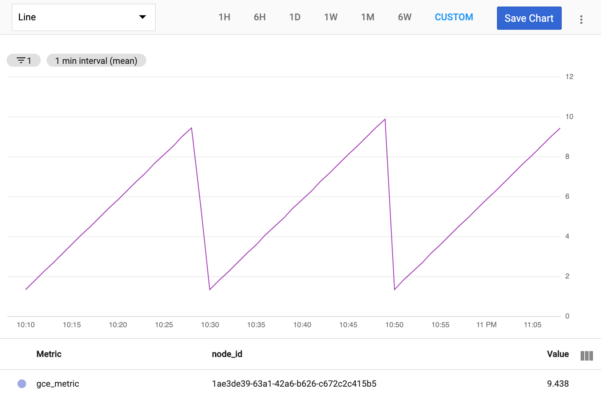
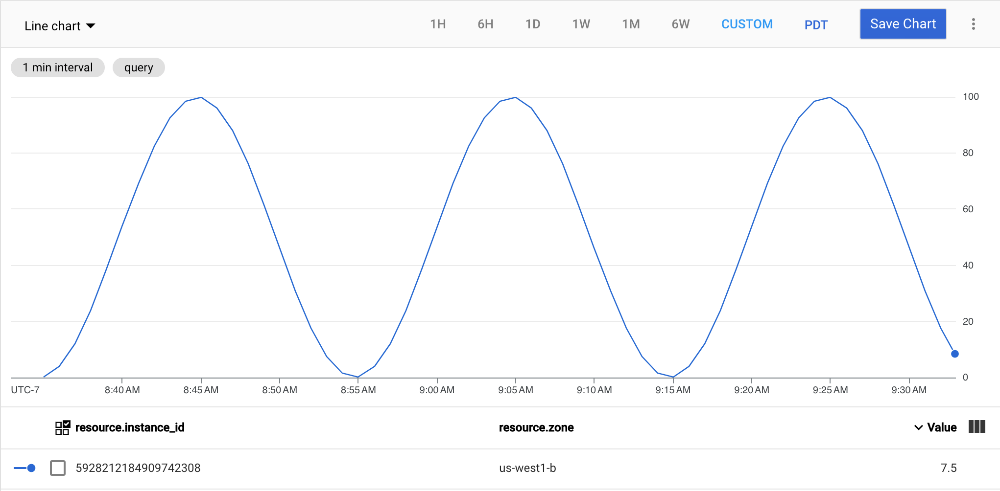
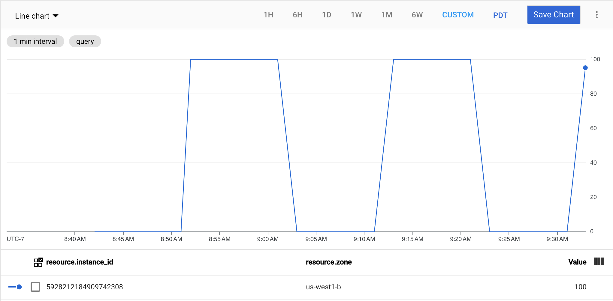
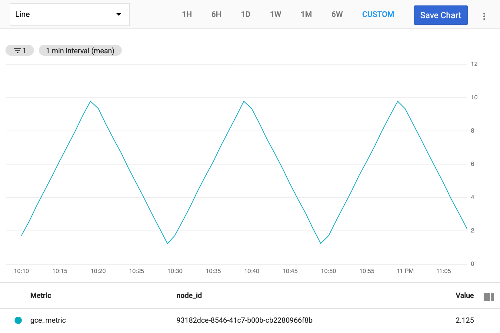

# GCP custom metric generator


[](CODE_OF_CONDUCT.md)
[](https://pkg.go.dev/github.com/memes/gce-metric)
[](https://goreportcard.com/report/github.com/memes/gce-metric)

A synthetic metric generator for Google Cloud that will create a time-series of
artificial metrics that can be consumed by an autoscaler, or other metric-bound
resource. The application will automatically generate a time-series
with labels appropriate for [gce_instance] or [gke_container] metrics, if detected,
with fallback to [generic_node] metrics.

## Usage

The application has three-forms of operation; *generator*, *list*, and *delete*.

### Generator

<!-- spell-checker: disable -->
```shell
gce-metric waveform [flags] NAME
```
<!-- spell-checker: enable -->

- *waveform* is one of sawtooth, sine, square, or triangle, and sets the pattern
  for the metrics (see images below)
- **NAME** is the custom metric type to add to GCP; this name must not conflict
  with existing metrics provided by GCP, and convention suggests that it be of
  the form `custom.googleapis.com/name` - see GCP [creating metrics] docs for
  details.

All options have a default values which can be overridden through command line
flags, environment variables, or a configuration file.

- `--floor N` sets the minimum value for the cycles, can be an integer or floating
  point value
- `--ceiling N` sets the maximum value for the cycles, can be an integer of
  floating point value
- `--period T` sets the duration for one complete cycle from floor to ceiling,
  must be valid Go duration string (see [time.ParseDuration])
- `--sample T` sets the interval between sending metrics to Google Monitoring,
  must be valid Go duration string (see [time.ParseDuration])
- `--verbose` set the logging levels to include more details
- `--integer` forces the generated metrics to be integers, making them less smooth
  and more step-like

> **NOTE:** Custom metric names can be reused as long as the type of the metric
> doesn't change; i.e. if you created a metric with floating point values, and
> then try to use `--integer` with the same metric name it will fail.

When executed on a GCE VM, or in a container with access to GCE metadata, the
project identifier (and other details) will be pulled from the metadata server.
If you run the application on a non-GCP system you will need to ensure you are
authenticated to GCP and authorised to create metric time-series.

- `--project ID` will set (or override discovered) project ID for the metrics
<!-- TODO @memes This functionality is missing
- `--metric-labels key1=value1,key2=value2` and `--resource-labels key1=value1,key2=value2`
  can be used to populate the metric and resource labels assigned to the time
  series, respectively.
-->

#### Example: Sawtooth



<!-- spell-checker: disable -->
```shell
gce-metric sawtooth --floor 0 --ceiling 100 --period 20m --sample 30s custom.googleapis.com/gce_metric/sawtooth
```
<!-- spell-checker: enable -->

#### Example: Sine



<!-- spell-checker: disable -->
```shell
gce-metric sine --floor 0 --ceiling 100 --period 20m --sample 30s custom.googleapis.com/gce_metric/sine
```
<!-- spell-checker: enable -->

#### Example: Square



<!-- spell-checker: disable -->
```shell
gce-metric square --floor 0 --ceiling 100 --period 20m --sample 30s custom.googleapis.com/gce_metric/square
```
<!-- spell-checker: enable -->

#### Example: Triangle



<!-- spell-checker: disable -->
```shell
gce-metric triangle --floor 0 --ceiling 100 --period 20m --sample 30s custom.googleapis.com/gce_metric/triangle
```
<!-- spell-checker: enable -->

### List

To list custom metrics

<!-- spell-checker: disable -->
```shell
gce-metric list [--verbose] [--project ID --filter FILTER]
```
<!-- spell-checker: enable -->

- `--filter` applies a [metric filter] to the list. If omitted, the default filter
  will limit the results to metrics matching `custom.googleapis.com/*` in the
  project.

### Delete

To delete one or more custom metrics use

<!-- spell-checker: disable -->
```shell
gce-metric delete [--verbose] [--project ID] NAME...
```
<!-- spell-checker: enable -->

or combine with [list](#list) to delete all custom metrics matching a criteria

<!-- spell-checker: disable -->
```shell
gce-metric list [--project ID] --filter FILTER | \
   xargs gce-metric delete [--project ID]
```
<!-- spell-checker: enable -->

## Binaries

Binaries are published on the [Releases] page for Linux, macOS, and Windows. If
you have Go installed locally, `go install github.com/memes/gce-metric/cmd/gce-metric`
will download and install to *$GOBIN*.

A container image is also published to Docker Hub and GitHub Container Registries
that can be used in place of the binary; just append the arguments to the
`docker run` or `podman run` command.

E.g.

<!-- spell-checker: disable -->
```shell
podman run -d --rm --name gce-metric \
   ghcr.io/memes/gce-metric:v1.2.3 \
   sawtooth -period 1h -sample 2m
```
<!-- spell-checker: enable -->

## Verifying releases

For each tagged release, an tarball of the source and a [syft] SBOM is created,
along with SHA256 checksums for all files. [cosign] is used to automatically generate
a signing certificate for download and verification of container images.

### Verify release files

1. Download the checksum, signature, and signing certificate file from GitHub

   <!-- spell-checker: disable -->
   ```shell
   curl -sLO https://github.com/memes/gce-metric/releases/download/v1.2.3/gce-metric_1.2.3_SHA256SUMS
   curl -sLO https://github.com/memes/gce-metric/releases/download/v1.2.3/gce-metric_1.2.3_SHA256SUMS.sig
   curl -sLO https://github.com/memes/gce-metric/releases/download/v1.2.3/gce-metric_1.2.3_SHA256SUMS.pem
   ```
   <!-- spell-checker: enable -->

2. Verify the SHA256SUMS have been signed with [cosign]

   <!-- spell-checker: disable -->
   ```shell
   cosign verify-blob \
      --cert gce-metric_1.2.3_SHA256SUMS.pem \
      --signature gce-metric_1.2.3_SHA256SUMS.sig \
      gce-metric_1.2.3_SHA256SUMS
   ```

   ```text
   verified OK
   ```
   <!-- spell-checker: enable -->

3. Download and verify files

   Now that the checksum file has been verified, any other file can be verified
   using `sha256sum`.

   For example

   <!-- spell-checker: disable -->
   ```shell
   curl -sLO https://github.com/memes/gce-metric/releases/download/v1.2.3/gce-metric-1.2.3.tar.gz.sbom
   curl -sLO https://github.com/memes/gce-metric/releases/download/v1.2.3/gce-metric_1.2.3_linux_amd64
   sha256sum --ignore-missing -c gce-metric_1.2.3_SHA256SUMS
   ```

   ```text
   gce-metric-1.2.3.tar.gz.sbom: OK
   gce-metric_1.2.3_linux_amd64: OK
   ```
   <!-- spell-checker: enable -->

### Verify container image

Use [cosign]s experimental OCI signature support to validate the container.

<!-- spell-checker: disable -->
```shell
COSIGN_EXPERIMENTAL=1 cosign verify ghcr.io/memes/gce-metric:v1.2.3
```
<!-- spell-checker: enable -->

[gce_instance]: https://cloud.google.com/monitoring/api/resources#tag_gce_instance
[gke_container]: https://cloud.google.com/monitoring/api/resources#tag_gke_container
[generic_node]: https://cloud.google.com/monitoring/api/resources#tag_generic_node
[creating metrics]: https://cloud.google.com/monitoring/custom-metrics/creating-metrics#custom_metric_names
[time.ParseDuration]: https://golang.org/pkg/time/#ParseDuration
[Releases]: https://github.com/memes/gce-metric/releases
[cosign]: https://github.com/SigStore/cosign
[syft]: https://github.com/anchore/syft
[metric filter]: https://cloud.google.com/monitoring/api/v3/filters#filter_syntax
