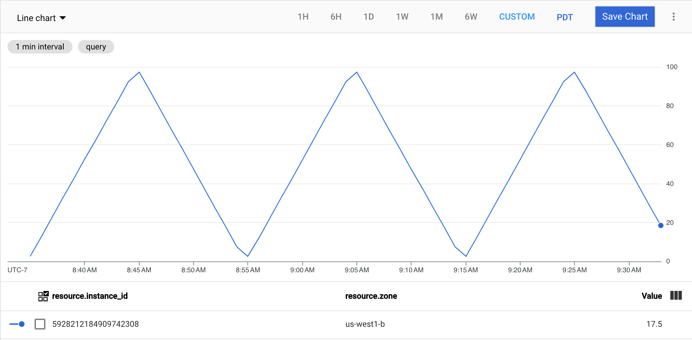

# GCP custom metric generator


A synthetic metric generator for Google Cloud that will create a timeseries ofartificial metrics intended to be consumed by an Autoscaler instance. The application will automatically generate a time-series of per-instance [gce_instance](https://cloud.google.com/monitoring/api/resources#tag_gce_instance) metrics if executed on one or more GCE instances, or a single series of [generic_node](https://cloud.google.com/monitoring/api/resources#tag_generic_node) metrics that can be used for per-group scaling.

## Usage

The application has three-forms of operation; *generator*, *delete*, and *list*.

### Generator

```sh
gce-metric waveform [FLAGS] NAME
```

- *waveform* is one of sawtooth, sine, square, or triangle, and sets the pattern for the metrics (see images below)
- **NAME** is the custom metric type to add to GCP; this name must not conflict with existing metrics provided by GCP, and convention suggests that it be of the form `custom.googleapis.com/name` - see GCP [docs](https://cloud.google.com/monitoring/custom-metrics/creating-metrics#custom_metric_names) for details

All options have a default value, but can be changed through flags:

- `-floor N` sets the minimum value for the cycles, can be an integer or floating point value
- `-ceiling N` sets the maximum value for the cycles, can be an integer of floating point value
- `-period T` sets the duration for one complete cycle from floor to ceiling, must be valid Go duration string (see [time.ParseDuration](https://golang.org/pkg/time/#ParseDuration))
- `-sample T` sets the interval between sending metrics to Google Monitoring, must be valid Go duration string (see [time.ParseDuration](https://golang.org/pkg/time/#ParseDuration))
- `-quiet` and `-verbose` set the logging levels to exclude or include more details
- `-round` forces the generated metrics to be integers, making them 'steppier'

> **NOTE:** Custom metrics can be reused as long as the type of the metric doesn't change; i.e. if you created a metric with floating point values, and then try to use `-round` on the same metric it will fail.

If the application is executed on a GCE VM or in a container on a GCE VM the project identifier (and other details) will be pulled from metadata. If running on a non-GCP system, you will need to ensure you are authenticated to GCP and authorised to create metric timeseries.

- `-project ID` will set (or override discovered) project ID for the metrics
- `-metriclabels key1:value1,key2:value2` and `-resourcelabels key1:value1,key2:value2` can be used to populate the metric and resource labels assigned to the time series, respectively.

#### Example

To generate synthetic metrics called `custom.googleapis.com/custom_metric` that start at 0 and rise to 10 in a sawtooth pattern each hour

```sh
gce-metric sawtooth -floor 0 -ceiling 10 -period 1h custom.googleapis.com/custom_metric
```

#### Sawtooth in Metrics Explorer


```sh
./gce-metric sawtooth -floor 1 -ceiling 10 -period 20m -sample 30s custom.googleapis.com/gce_metric
```

#### Sine in Metrics Explorer


```sh
./gce-metric sine -floor 1 -ceiling 10 -period 20m -sample 30s custom.googleapis.com/gce_metric
```

#### Square in Metrics Explorer


```sh
./gce-metric square -floor 1 -ceiling 10 -period 20m -sample 30s custom.googleapis.com/gce_metric
```

#### Triangle in Metrics Explorer



```sh
./gce-metric triangle -floor 1 -ceiling 10 -period 20m -sample 30s custom.googleapis.com/gce_metric
```

### List

To list custom metrics

```sh
gce-metric list [-quiet | -verbose] [-project ID -filter F]
```

- `-filter` applies a [filter](https://cloud.google.com/monitoring/api/v3/filters#metric-descriptor-filter) to the list. The default filter will limit the results to the metrics matching `custom.googleapis.com/*`

> **NOTE:** to get a list suitable for piping, include the `-quiet` flag to supress logging output.

### Delete

To delete one or more custom metrics use

```sh
gce-metric delete [-quiet | -verbose] [-project ID] NAME...
```

or combine with [list](#list) to delete all custom metrics

```sh
gce-metric list -quiet [-project ID] | xargs gce-metric delete [-project ID]
```

## Binaries

Binaries are published on the [Releases](https://github.com/memes/gce-metric/releases) page for Linux, macOS, and Windows. If you have Go installed locally, `go get github.com/memes/gce-metric` will download and install to *$GOBIN*.

A Docker image is also published to Docker registry that can be used in place of the binary; just append the arguments to the `docker run` command.

E.g.

```sh
docker run -d --rm --name gce-metric memes/gce-metric:1.1.0 sawtooth -period 1h -sample 2m
```
