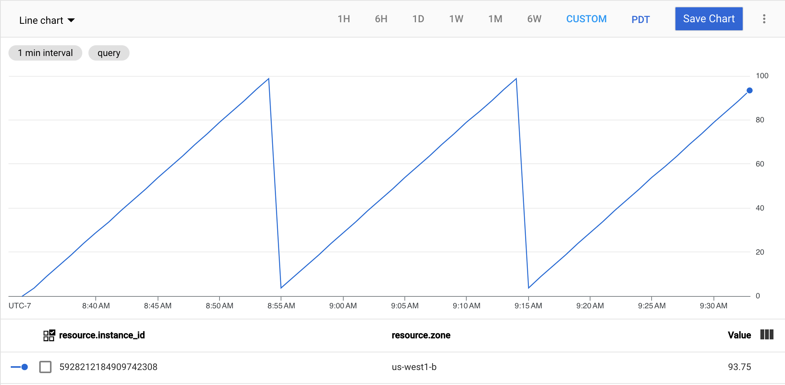

# GCP custom metric generator


A synthetic metric generator for Google Cloud that will create a timeseries of artificial metrics intended to be consumed by an Autoscaler instance. The application will automatically generate a time-series of per-instance [gce_instance](https://cloud.google.com/monitoring/api/resources#tag_gce_instance) metrics if executed on one or more GCE instances, or a single series of [generic_node](https://cloud.google.com/monitoring/api/resources#tag_generic_node) metrics that can be used for per-group scaling.

## Usage

Binaries are published on the [Releases](https://github.com/memes/gce-metric/releases) page for Linux, macOS, and Windows. If you have Go installed locally, `go get github.com/memes/gce-metric` will download and install to *$GOBIN*.

A Docker image is also published to Docker registry that can be used in place of the binary; just append the arguments to the `docker run` command.

E.g.

```sh
docker run -d --rm --name gce-metric memes/gce-metric:1.0.5 sawtooth -period 1h -sample 2m
```

## Examples

### Sawtooth



```sh
./gce-metric -floor 1 -ceiling 10 -period 20m -sample 30s sawtooth
```

## Sine


```sh
./gce-metric -floor 1 -ceiling 10 -period 20m -sample 30s sine
```

### Square


```sh
./gce-metric -floor 1 -ceiling 10 -period 20m -sample 30s square
```

### Triangle


```sh
./gce-metric -floor 1 -ceiling 10 -period 20m -sample 30s triangle
```
